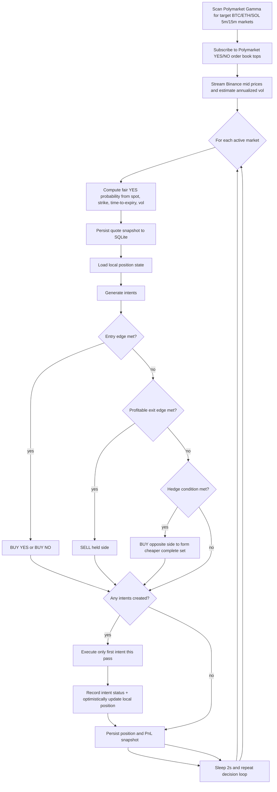

# hail

Automated Polymarket trading bot for short-horizon crypto binary markets (5m/15m) on BTC/ETH/SOL.

## Features

- Scans Polymarket Gamma markets for BTC/ETH/SOL 5m/15m contracts.
- Streams Binance mid-prices over websocket for fair-odds estimation.
- Streams Polymarket CLOB market data over websocket for best bid/ask updates.
- Places BUY/SELL orders on YES/NO with fixed order size (default: 5 shares).
- Manages trade lifecycle using:
  - entry edge checks,
  - profitable exits,
  - opposite-side hedge opportunities.
- Persists markets, quotes, intents, positions, and PnL snapshots to SQLite.
- Sends periodic Telegram PnL summaries.
- Uses daily rotating logs with 3 days retention in `/logs`.

## Setup (uv)

1. Install dependencies:

```bash
uv sync
```

2. Fill in secrets and settings in `.env`:

- `PRIVATE_KEY` (required)
- `FUNDER_ADDRESS` (required for proxy setups)
- `TELEGRAM_BOT_TOKEN`, `TELEGRAM_CHAT_ID` (optional, but needed for notifications)

3. Ensure writable directories exist:

- `/logs` for logs
- `/data` for SQLite database

4. Run:

```bash
uv run hail-bot
```

## Core Strategy Rules

- **Entry**: Buy YES when `fair_yes - yes_ask >= MIN_ENTRY_EDGE`; buy NO analogously.
- **Exit**: Sell held side when bid exceeds average cost by at least `MIN_EXIT_EDGE`.
- **Hedge**: If holding one side, buy opposite side if combined cost leaves at least
  `MIN_HEDGE_MARGIN` against a complete-set payout of `1.0`.

## Main Strategy Flow



## Important Notes

- This bot updates positions optimistically on posted orders. For production use, add
  fill reconciliation from trade/user events before scaling capital.
- The question parser expects BTC/ETH/SOL wording and explicit strike in the market question.
- This is not financial advice. Run with small size first and validate behavior on your account.