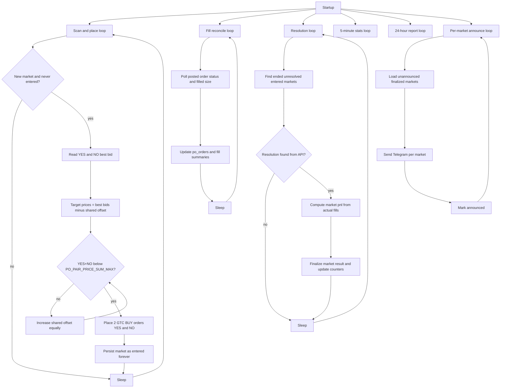

# hail po strategy

PO is the place-once strategy.

## Strategy behavior

- Scans configured 5m/15m Polymarket markets.
- For each never-before-entered market, reads YES/NO best bids.
- Places one GTC buy order on each side at an equal shared offset from best bid.
- Increases that shared offset as needed to keep `yes_price + no_price < PO_PAIR_PRICE_SUM_MAX`.
- Never re-enters the same market again.
- Reconciles order fills asynchronously.
- Finalizes market PnL after resolution and tracks three winrates:
  - both legs filled,
  - one leg filled,
  - combined.
- Logs summary stats every 5 minutes.
- Sends per-market resolution Telegram updates and a 24h Telegram report.

## Flow



## Run

```bash
uv run hail-po
```

Dry run:

```bash
PO_DRY_RUN=true uv run hail-po
```

## Config

PO settings in `.env`:

- `PO_SCAN_INTERVAL_SECONDS` (default: `30`)
- `PO_FILL_POLL_INTERVAL_SECONDS` (default: `15`)
- `PO_RESOLUTION_POLL_INTERVAL_SECONDS` (default: `30`)
- `PO_STATS_INTERVAL_SECONDS` (default: `300`)
- `PO_DAILY_REPORT_INTERVAL_SECONDS` (default: `86400`)
- `PO_DAILY_REPORT_ENABLED` (default: `true`)
- `PO_RESET_STATS_ON_START` (default: `false`)
- `PO_ORDER_SIZE` (default: `5`)
- `PO_PRICE_TICK` (default: `0.01`)
- `PO_PAIR_PRICE_SUM_MAX` (default: `0.98`)
- `PO_DRY_RUN` (default: `false`)

General required settings:

- `PRIVATE_KEY`
- `FUNDER_ADDRESS` (if needed by your setup)
- `TELEGRAM_BOT_TOKEN` and `TELEGRAM_CHAT_ID` (for notifications)

